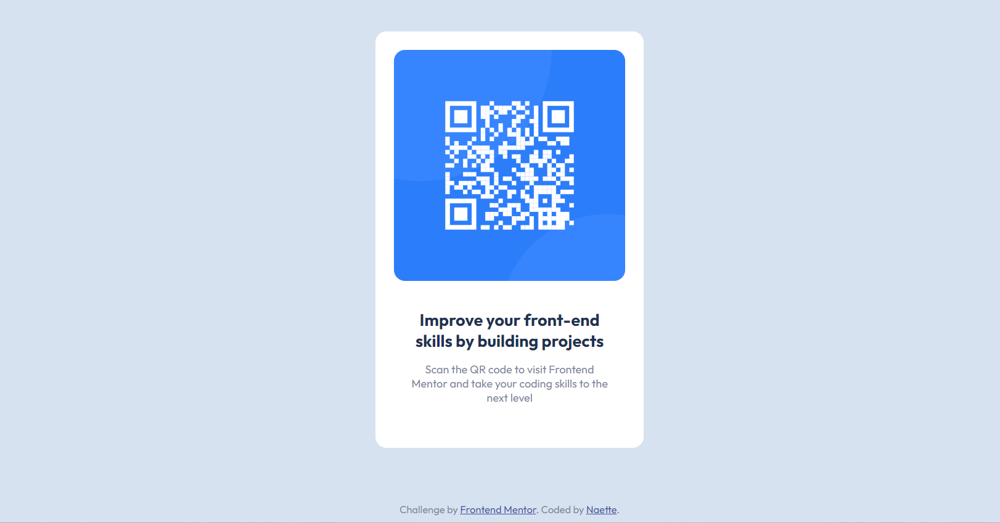

# Frontend Mentor - QR code component solution

This is a solution to the [QR code component challenge on Frontend Mentor](https://www.frontendmentor.io/challenges/qr-code-component-iux_sIO_H). Frontend Mentor challenges help you improve your coding skills by building realistic projects. 

## Table of contents

- [Overview](#overview)
  - [Screenshot](#screenshot)
  - [Links](#links)
- [My process](#my-process)
  - [Built with](#built-with)
  - [What I learned](#what-i-learned)
  - [Continued development](#continued-development)
  - [Useful resources](#useful-resources)
- [Author](#author)


## Overview
- this was an interesting challenge for me as I tried writing it using pure CSS without using any frameworks such as Bootstrap which would have made it easier. 

### Screenshot




### Links

- Solution URL: [Add solution URL here](https://your-solution-url.com)
- Live Site URL: [Add live site URL here](https://your-live-site-url.com)
- Source: https://uiverse.io/ 

## My process
- created two sections on the card, one for the image and the other section for the detail.
- having done so the I made the class with image into a place holder before I could add the image.
- Once I was sure the ratio of the two section was sorted I then added the image setting it to a width that fitted my image div.
- Once established I then created another div which I called conatiner to center my card in using flexbox.
- No need to do the mobile view since the image was static. 

### Built with

- Semantic HTML5 markup
- CSS custom properties
- Flexbox


### What I learned
- Centering objects divs, images, image fitting but mostly centering.
- 

To see how you can add code snippets, see below:

```css
.card-container {
    display: flex;
    align-items: center;
    justify-content: center;
    height: 100vh;
    
  }

.card {
    
    background-color: hsl(0, 0%, 100%);
    min-height: 300px;
    width: 250px;
    border-radius: 12px;
    padding: 20px;
}
```


### Continued development
- centering objects in css , as well as fitting images into divs.

**Note: Delete this note and the content within this section and replace with your own plans for continued development.**

### Useful resources

- [Example resource 1](https://www.freecodecamp.org/news/css-vertical-align-how-to-center-a-div-text-or-an-image-example-code/) - helpful on how to center objects
- [Uiverse] (https://uiverse.io/cards) - Basic card html and outline
**Note: Delete this note and replace the list above with resources that helped you during the challenge. These could come in handy for anyone viewing your solution or for yourself when you look back on this project in the future.**

## Author

- Website - [On the way](https://www.your-site.com)
- Frontend Mentor - [@naette](https://www.frontendmentor.io/profile/naette)
- Twitter - [@yourusername](https://www.twitter.com/yourusername)

